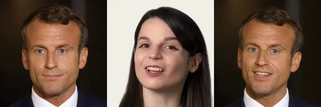
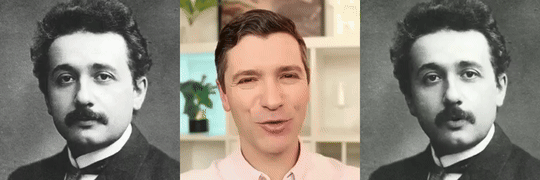
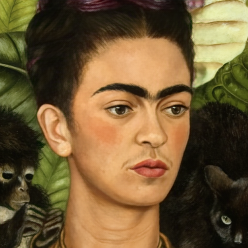
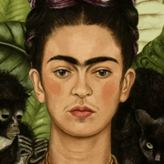
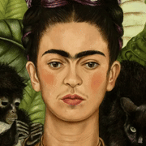

# LIA-X: Interpretable Latent Portrait Animator
Yaohui Wang, Di Yang, Xinyuan Chen, François Brémond, Yu Qiao, Antitza Dantcheva
### [Project Page](https://wyhsirius.github.io/LIA-X-project/) | [Paper]()


## Setup

Prepare the environment and download [model]() from huggingface to `./models`. 

```bash
git clone https://github.com/wyhsirius/LIA-X
cd LIA-X
conda env create -f environment.yml
conda activate liax
```

## Gradio Interface 
We recommend to use [gradio interface]() to test the model. To run it locally:

```bash
python app.py
```

**Instruction:** In the interface, we provide two tabs `Animation & Image Editing` and `Video Edting`, they all support fine-grained manipulation for `head`, `mouth` and `eyes` using the `Control Panel`.
- **Animation & Image Editing**
  1. Image Animation
    - Upload `Source Image` and `Driving Video`
    - Use `Control Panel` to edit source image and `Edit` button to display the `Edited Source Image`
    - Use `Animate` button to obtain `Animated Video`
  2. Image Editing
    - Upload `Source Image`
    - Use `Control Panel` to edit source image and `Edit` button to display the `Edited Source Image`
- **Video Editing**
    - Upload `Video`
    - Use `Control Panel` to edit first frame of video and `Edit` button to display the `Edited Image`
    - Use `Generate` button to obtain `Edited Video`


## Inference
You can use `inference.py` to run the demo. Use `--mode` flag to choose the setting from `image animation`, `video editing`, `image editing` and `linear interpolation`. The `--cfg` flag indicates the path of corresponding configuration files. Try to play with `motion_id` and `motion_value` in configuration file to obtain different results. The following are some examples generated by using the provided configurations.

**1. Image Animation**
```bash
python inference.py --mode animation --cfg 'config/animation/animation1.yaml'
python inference.py --mode animation --cfg 'config/animation/animation6.yaml'
```
 

**2. Video Editing**
```bash
python inference.py --mode vid_edit --cfg 'config/vid_edit/demo1.yaml' # head rotation
python inference.py --mode vid_edit --cfg 'config/vid_edit/demo2.yaml' # closing eyes
```
     


**3. Image Editing**
```bash
python inference.py --mode img_edit --cfg 'config/img_edit/demo1.yaml'
python inference.py --mode img_edit --cfg 'config/img_edit/demo2.yaml'
python inference.py --mode img_edit --cfg 'config/img_edit/demo3.yaml'
python inference.py --mode img_edit --cfg 'config/img_edit/demo4.yaml'
```
   

**4. Linear Interpolation**
```bash
python inference.py --mode interpolation --cfg 'config/interpolation/demo1.yaml' # head rotation
python inference.py --mode interpolation --cfg 'config/interpolation/demo2.yaml' # pout
python inference.py --mode interpolation --cfg 'config/interpolation/demo5.yaml' # close eyes
python inference.py --mode interpolation --cfg 'config/interpolation/demo6.yaml' # move eyeballs
```
   

**5. Animating your own data**

1. Modify your configutation file and set `source_path`, `driving_path` and `save_dir` with correct data paths.
2. By default (`motion_value=0`), the source image will not be edited. Play with `motion_value` to obtain the best results.
```bash
python inference.py --mode animation --cfg <YOUR_CONFIG_FILE_PATH>
```

