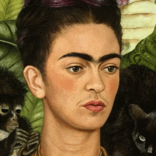

# LIA-X: Interpretable Latent Portrait Animator
[Yaohui Wang](https://wyhsirius.github.io/), [Di Yang](https://walker1126.github.io/), [Xinyuan Chen](https://scholar.google.com/citations?user=3fWSC8YAAAAJ&hl=zh-CN), [François Brémond](https://www-sop.inria.fr/members/Francois.Bremond/), [Yu Qiao](https://scholar.google.com/citations?user=gFtI-8QAAAAJ&hl=en), [Antitza Dantcheva](https://www-sop.inria.fr/members/Antitza.Dantcheva/)

[](https://arxiv.org/abs/2508.09959)
[](https://wyhsirius.github.io/LIA-X-project/)
[](https://huggingface.co/spaces/YaohuiW/LIA-X)
[](https://huggingface.co/YaohuiW/LIA-X/tree/main)

This is the official PyTorch codebase for [LIA-X](https://arxiv.org/abs/2508.09959). LIA-X has developped original [LIA](https://github.com/wyhsirius/LIA) into a new level, where now it supports interpretable and fine-grained control of *head*, *mouth* and *eyes*.


## News
**2025.08.20:** [LIA-X](https://huggingface.co/spaces/YaohuiW/LIA-X) is selected as **Spaces of the Week** on HuggingFace!

**2025.08.13:** We release **paper**, **model** and **inference code**!

## Setup

```bash
git clone https://github.com/wyhsirius/LIA-X
cd LIA-X
```

Setting up the environment and download [pre-trained model](https://huggingface.co/YaohuiW/LIA-X/tree/main) to `./model`. 

```bash
conda create -n liax python=3.10
conda activate liax
pip install -r requirements.txt
```

## Gradio UI 
Run following command to launch Gradio UI locally. For online interface, visit [HF Space](https://huggingface.co/spaces/YaohuiW/LIA-X). 

```bash
python app.py
```

<details>
  
<summary>Instruction</summary>

We provide three tabs `Image Animation`, `Image Editing` and `Video Edting`, they all support fine-grained manipulation for `head`, `mouth` and `eyes` using the `Control Panel`.
- **Image Animation**
    - Upload `Source Image` and `Driving Video`
    - Use `Control Panel` to edit source image and `Edit` button to display the `Edited Source Image`
    - Use `Animate` button to obtain `Animated Video`
- **Image Editing**
    - Upload `Source Image`
    - Use `Control Panel` to edit source image and `Edit` button to display the `Edited Source Image`
- **Video Editing**
    - Upload `Video`
    - Use `Control Panel` to edit first frame of video and `Edit` button to display the `Edited Image`
    - Use `Generate` button to obtain `Edited Video`

</details>

## Command Line Inference
You can use `inference.py` to run the demo. Use `--mode` flag to choose the setting from `animation`, `img_edit`, `vid_edit` and `manipulation`. The `--cfg` flag indicates the path of corresponding configuration files. The `--chunk_size` flag indicates how many frames the model will process at each iteration, larger value brings faster inference speed. You should adjust this value based on your GPU. 

Play with `motion_id` and `motion_value` in configuration file to obtain different results. The following are some examples generated by using the provided configurations.

**1. Image Animation**
```bash
python inference.py --mode animation --cfg 'config/animation/animation1.yaml'
python inference.py --mode animation --cfg 'config/animation/animation6.yaml'
```
 

**2. Video Editing**
```bash
python inference.py --mode vid_edit --cfg 'config/vid_edit/demo1.yaml' # yaw
python inference.py --mode vid_edit --cfg 'config/vid_edit/demo2.yaml' # closing eyes
```
     


**3. Image Editing**
```bash
python inference.py --mode img_edit --cfg 'config/img_edit/demo1.yaml' # yaw
python inference.py --mode img_edit --cfg 'config/img_edit/demo2.yaml' # pout
python inference.py --mode img_edit --cfg 'config/img_edit/demo3.yaml' # close eyes
python inference.py --mode img_edit --cfg 'config/img_edit/demo4.yaml' # move eyeballs
```
   

**4. Linear Manipulation**
```bash
python inference.py --mode manipulation --cfg 'config/manipulation/demo1.yaml' # yaw
python inference.py --mode manipulation --cfg 'config/manipulation/demo2.yaml' # pitch
python inference.py --mode manipulation --cfg 'config/manipulation/demo5.yaml' # close & open eyes
python inference.py --mode manipulation --cfg 'config/manipulation/demo6.yaml' # move eyeballs
```
   

**5. Animating Your Own Data**

1. Data preperation (image & video cropping)
```bash
python utils/crop.py --mode img --data_path <YOUR_IMG_PATH> # crop image
python utils/crop.py --mode vid --data_path <YOUR_VID_PATH> # crop video
```
You can use `increase_scale` and `increase_top_scale` flags to adjust bounding box scales. Results will be saved at `./data/source` and `./data/driving`

2. Set correct `source_path`, `driving_path` and `save_dir` in your configuration file
3. Play with `motion_value` in configuration and run following command. By default (`motion_value=0`), the source image will not be edited. 
```bash
python inference.py --mode animation --cfg <YOUR_CONFIG_FILE_PATH>
```

## Citation
```bibtex
@article{wang2025lia,
  title={LIA-X: Interpretable Latent Portrait Animator},
  author={Wang, Yaohui and Yang, Di and Chen, Xinyuan and Bremond, Francois and Qiao, Yu and Dantcheva, Antitza},
  journal={arXiv preprint arXiv:2508.09959},
  year={2025}
}
```

